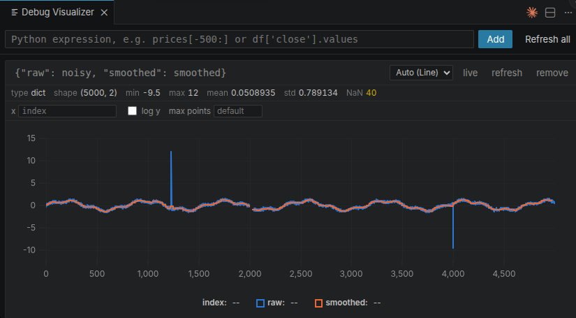
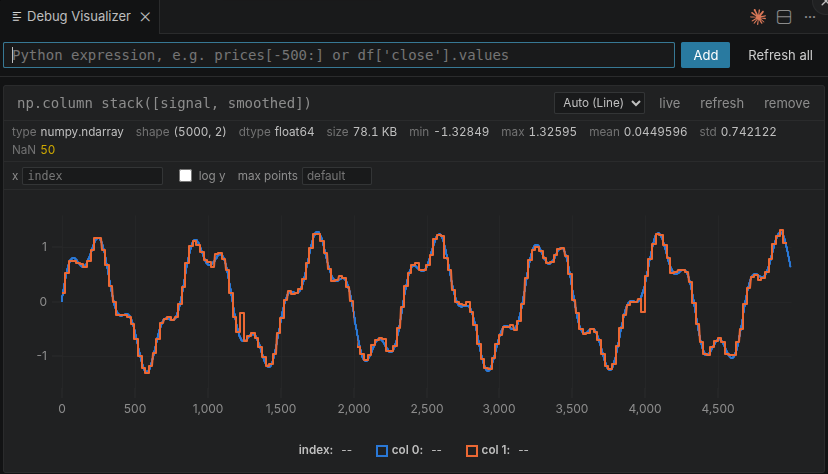
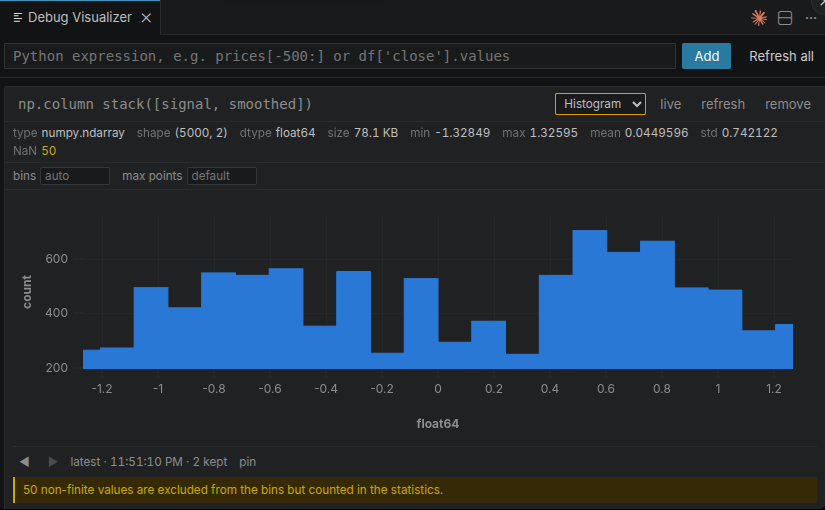
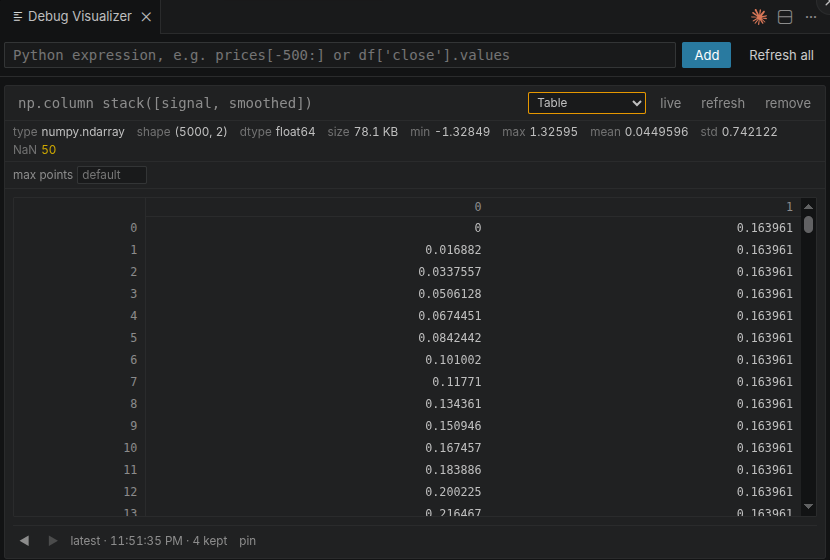
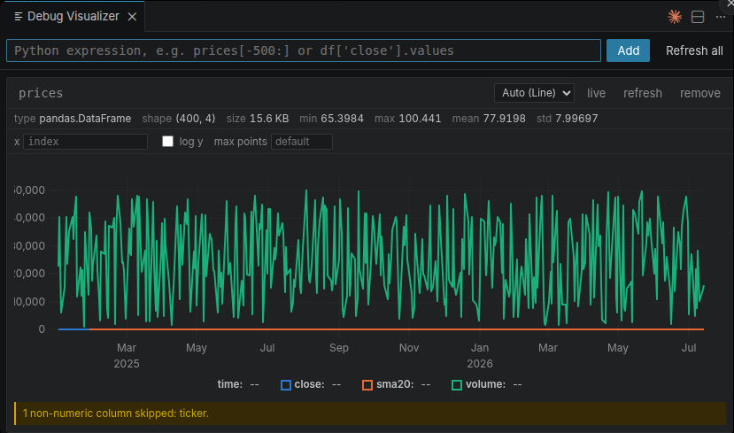
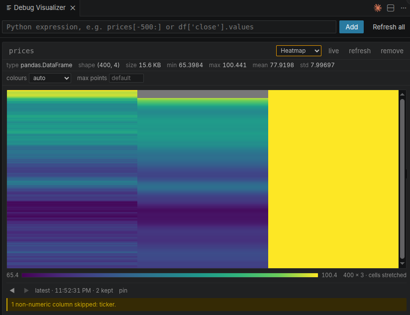

# Python Debug Visualizer

[](https://github.com/JanLucasK/Python-Debug-Visualizer/actions/workflows/ci.yml)
[](LICENSE)

Plot and inspect NumPy arrays, Pandas DataFrames and tensors **while you are
stopped in the debugger**. Type an expression, see the data.



*Two arrays from one expression. The gap at x ≈ 2000 is real — 40 NaN, and the
statistics say so. The spikes at 1234 and 3999 are single samples the plot is
far too coarse to draw, which is exactly why `min` and `max` are there.*

> **Status: 0.1.0.** Everything below works and is covered by tests, including
> runs against a real debugpy session.
>
> One claim is reasoned rather than measured: it has not been run against a real
> Remote-SSH or dev-container setup. See [docs/architecture.md](docs/architecture.md).

## Why

VS Code can already show you a DataFrame as a table, and it can show you an
image. What it cannot do is answer the question you actually have at a
breakpoint: *did this array change the way I expected?*

This extension is built for stepping through an algorithm — plotting the same
expression at successive steps, overlaying them, and seeing what moved.

## What it does

- **Plots** — line, multi-line, scatter, histogram, heatmap and image, plus a
  virtualised table. Pick per pane, or let the runtime suggest.
- **Statistics you can trust** — shape, dtype, min/max/mean/std and NaN/Inf
  counts, always computed over the *whole* value even when the plot is
  downsampled.
- **Step back and compare** — every pane keeps its recent captures. Scrub
  through them, pin one, and later steps are drawn against it with a count of
  what actually moved.
- **Zoom that adds detail** — the runtime re-captures inside the visible range
  rather than showing you fewer of the same points.
- **No `pip install` in your project.** The Python runtime is injected into the
  debug session, so it works in virtualenvs, containers and over SSH.

Supported out of the box: **NumPy** arrays, **Pandas** DataFrames, Series and
indexes, **PyTorch** and **TensorFlow** tensors, and plain lists and scalars.
Anything else is described rather than plotted — type, shape and repr, which is
usually enough.

Tensors are handled properly rather than nominally: a tensor with
`requires_grad` is readable, a CUDA tensor is copied without disturbing the
program, `bfloat16` widens instead of failing, and a sparse tensor is described
rather than silently densified into memory you may not have.

## Several series, six views

Each expression is one pane, so combining values means making the expression
produce them — a plain dict needs no library at all.

```python
{"raw": noisy, "smoothed": smoothed}   # a dict
prices[["close", "sma20"]]             # DataFrame columns
np.column_stack([signal, smoothed])    # a narrow array
```



The view is chosen per pane, or suggested from the value.

| | |
|:--|:--|
|  |  |
| Binning happens in the debuggee, so five million points become sixty bars before anything crosses the wire — and the pane says why the bars sum to less than the count. | A million cells would be a million DOM nodes, so only the visible rows exist. |
|  |  |
| Every numeric column becomes a line on a shared time axis, and the text column is reported rather than dropped. Note the trap: `volume` flattens the other two, so use `prices[["close", "sma20"]]` when units differ. | The same frame as a colour matrix, with its scale and a note that cells were stretched to fit. |

## How it works

```
 debugpy session
      │  DAP evaluate  (context: clipboard — no truncation)
      ▼
 _pdv.capture(expr)  ──▶  adapter  ──▶  descriptor + binary channels
      │
      │  base64 envelope  (repr-safe by construction)
      ▼
 extension host  ──postMessage──▶  webview  ──▶  uPlot / canvas
```

Three design decisions carry most of the weight:

**Evaluate with `context: "clipboard"`.** debugpy truncates strings at 64 KiB in
every other context — the limit that makes the existing tools in this space
unusable for real arrays. In `clipboard` context it does not.

**Base64 for the whole response.** A DAP evaluate response is the debug
adapter's *repr* of the result, so a returned JSON string comes back quoted and
escaped. Un-escaping that by hand is where other tools corrupt Windows paths and
regexes. Base64's alphabet contains nothing repr will ever touch, so the
transformation is trivially reversible.

**The webview never opens a socket.** Under Remote-SSH the extension host runs
on the remote machine while the webview runs locally, so `localhost` means two
different things. All data reaches the UI through `postMessage`, which behaves
identically local, over SSH, in a dev container and in Codespaces.

## Repository layout

| Package | What it is |
|---|---|
| [packages/protocol/](packages/protocol/) | Wire types shared by all three sides |
| [packages/runtime/](packages/runtime/) | Python, runs inside the debuggee. No dependencies |
| [packages/extension/](packages/extension/) | Extension host: debug session, transports, panels |
| [packages/webview/](packages/webview/) | UI: Preact, uPlot, canvas heatmaps |

See [docs/architecture.md](docs/architecture.md) for the full design, and
[examples/README.md](examples/README.md) for a guided tour of every feature.

## Contributing

[CONTRIBUTING.md](CONTRIBUTING.md) covers the setup and the one rule the design
follows from: a debugging tool that misleads you is worse than no tool.

## Development

```bash
pnpm install
pnpm build

python -m venv .venv && .venv/bin/pip install -e "packages/runtime[dev]"
.venv/bin/python -m pytest packages/runtime/tests -q
```

Press `F5` to launch an Extension Development Host.

### If VS Code tasks report `pnpm: command not found`

Tasks run under `bash -c`, which is non-interactive and therefore never sources
`~/.bashrc`. Version managers that install themselves there — nvm in particular —
are invisible to it, and the guard at the top of Ubuntu's stock `.bashrc` means
even a login shell will not help.

Put the binaries somewhere every shell looks:

```bash
ln -sf "$NVM_DIR/versions/node/$(node --version)/bin/"{node,npm,npx,corepack,pnpm} ~/.local/bin/
```

Then reload the VS Code window, so it picks up the new `PATH`.

## Relationship to other extensions

This is **not** a port of [hediet's Debug Visualizer](https://github.com/hediet/vscode-debug-visualizer)
and shares no code with it — that project is GPL-3, this one is MIT. It is a
Python-first tool built around plotting, where that one is a
language-agnostic tool built around structural views.

If you want images and tensors rendered as pictures,
[View Image for Python Debugging](https://github.com/elazarcoh/simply-view-image-for-python-debugging)
does that better than this does, and is worth installing alongside.

## License

MIT
